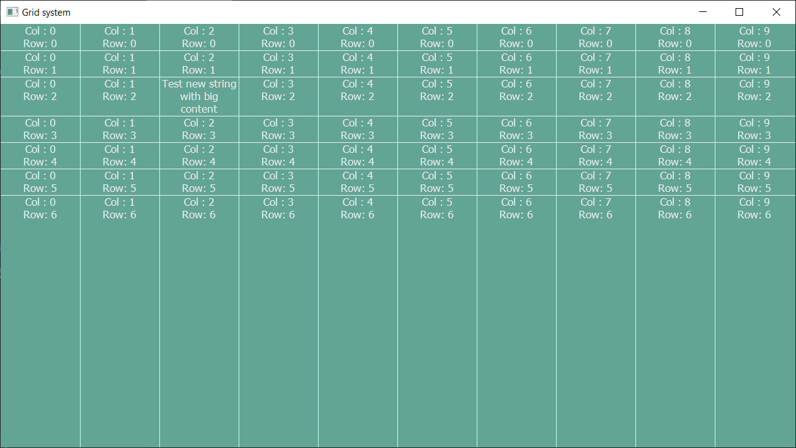

### C++ Gdiplus grid component

**In this work:**
- Independent on OS C++ graphics component "String Grid" (`StringGrid.h` and `StringGrid.cpp`)
- Flexible height of the elements, equal width for columns